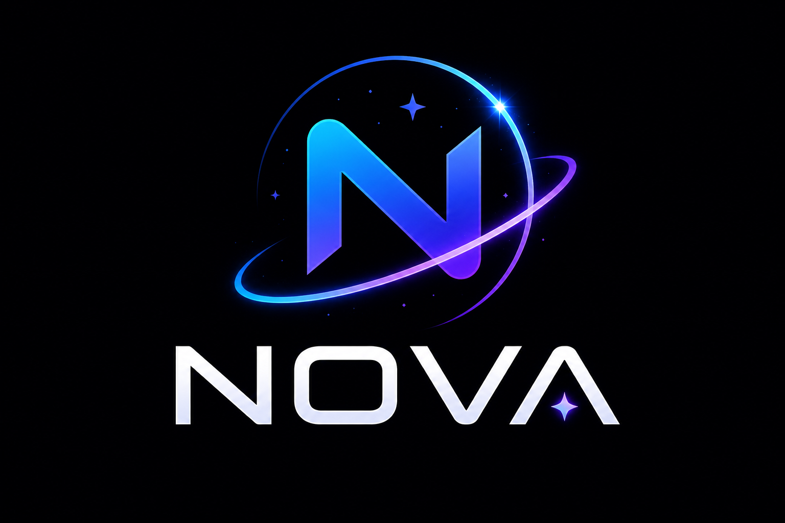

<div align="center">
  

  # NOVA — Think It. Build It.

  **Autonomous, Model-Agnostic, Project-Aware & Zero-Leak Coding Agent in Go**

  [](https://pkg.go.dev/github.com/awanmh/Nova)
  [](https://goreportcard.com/report/github.com/awanmh/Nova)
  [](https://opensource.org/licenses/MIT)
  [](https://github.com/awanmh/Nova)
  [](https://github.com/charmbracelet/bubbletea)

</div>

---

## Executive Summary

**NOVA** is an enterprise-grade, local-first AI software engineering runtime built with a strict **Hexagonal Architecture**. Designed for organizations that require complete data sovereignty, NOVA autonomously inspects repositories, plans refactorings, executes tools, and verifies tests without exposing proprietary source code or credentials to third-party servers.

---

## Enterprise Value Proposition

| Capability | NOVA | Traditional Cloud Copilots |
|---|---|---|
| **Data Sovereignty** | **100% Local-First** (Ollama / local LLMs) or dedicated OpenAI-compatible APIs | Compulsory cloud telemetry & remote code transmission |
| **Security & Compliance** | Built-in Secret Redactor, Path Traversal Blocklist & SSH/ENV Credential Sandboxing | Passive suggestions without filesystem boundaries |
| **AST Project Intelligence** | Automatic Go syntax-tree symbol extraction & relevance-ranked prompt assembly | Basic string matching & file heuristics |
| **Auditable Tool Engine** | 8 standard tools with policy-driven execution (`allow`/`ask`/`deny`) & `.nova/audit.log` | Non-auditable IDE plugin actions |

---

## Architecture

```
                       +----------------------------------+
                       |       CLI / Interactive TUI      |
                       +-----------------+----------------+
                                         |
                                         v
                       +----------------------------------+
                       |       Agent Execution Loop       |
                       |    (Understand -> Plan -> Exec)  |
                       +---------+---------------+--------+
                                 |               |
               +-----------------v---+       +---v-----------------+
               |    LLM Providers    |       |    Tool Executor    |
               |  (Ollama / OpenAI)  |       |  (Safe Tool Calls)  |
               +---------------------+       +---+-------------+---+
                                                 |             |
                                      +----------v--+       +--v-------------+
                                      |  Permission |       |  Audit Logger  |
                                      |    Engine   |       | (.nova/audit)  |
                                      +-------------+       +----------------+
```

### Core Subsystems
- **Domain Engine (`internal/agent`, `project`, `context`, `persona`)**: Manages autonomous iterative execution, Go AST symbol ranking, and 4 canonical engineering modes (`general`, `tdd`, `architect`, `security`).
- **Provider Registry (`internal/llm`)**: Seamlessly connects to local offline engines (**Ollama**, **llama.cpp**) or cloud OpenAI-compatible endpoints.
- **Safety & Audit Boundary (`internal/security`, `permission`, `tools`)**: Enforces workspace path boundaries, blocks sensitive files (`.env`, `.pem`, `id_rsa`), redacts secrets globally, and logs all tool invocations.
- **Presentation (`internal/cli`, `tui`)**: Interactive Dark-Mode Terminal UI (**Bubble Tea/Lip Gloss**) with real-time budget tracking and permission modals.

---

## Quick Start

### 1. Installation
```powershell
# Install latest release from GitHub (use GOPROXY=direct if Go proxy cache is stale)
$env:GOPROXY="direct"; go install github.com/awanmh/Nova/cmd/nova@latest
```

### 2. Interactive Engineering Session
Launch the interactive TUI in any repository:
```powershell
nova
# Or launch directly with a specific mode:
nova --persona=tdd --model=gpt-4o
```
- **Keybindings**: `Ctrl+P` (Switch Persona) | `Ctrl+L` (Clear Chat) | `Ctrl+H` (Help) | `Ctrl+C` (Quit)
- **Slash Commands**: `/model <name>`, `/apikey <key>`, `/persona <name>`, `/extensions`, `/plan`, `/compact`, `/clear`, `/quit`

### 3. NOVA CLI — FINAL MENU ARCHITECTURE v1.0 (Control Center)

NOVA never drops you directly into a raw chat prompt. The root is always a Control Center that orchestrates your local development environment:

```text
╭──────────────────────────────────────────────────────────╮
│                      N O V A                             │
│                From Thought to Thing.                    │
│                       v1.0.0                             │
╰──────────────────────────────────────────────────────────╯

  Local Agent Runtime

  Model       : qwen3-coder
  Persona     : general
  Project     : —
  Session     : —
  Extensions  : 5 enabled
  Status      : READY

────────────────────────────────────────────────────────────

  1. Agent       (New Project vs. Existing Project workflows)
  2. Persona     (Built-in, Custom Persona wizard, Manage)
  3. Model       (Ollama, LM Studio, OpenAI-Compatible)
  4. Project     (AST Intelligence, Rules, Memory, Re-index)
  5. Session     (Context Budget, Compact, History, Export)
  6. Extensions  (Installed, Browse, Install, Permissions, Health)
  7. Settings    (Planning, Execution, Permissions, Storage)
  8. Doctor      (Runtime, Storage, Permission & Index Diagnostics)
  9. About       (Version, License, Dependencies, Credits)
  0. Exit
```

#### The 3 Core Pathways of NOVA:
1. **New Project** (*"I have an idea"*) ➔ **Product Engineer** (`Idea -> PRD -> Architecture -> TDD -> Task Breakdown -> Implementation`)
2. **Existing Project** (*"Here is my codebase. Do X"*) ➔ **Senior Engineer** (`Workspace -> Scan -> Project Intelligence -> Review -> Prompt -> Micro Plan -> Execute`)
3. **Extensions** (*"Add relevant capabilities"*) ➔ **Extensible Runtime** (`Installed -> Enabled -> Registered -> Relevance Check -> Activated -> Used`)

### 4. AI Provider Setup (Local vs. Cloud)

#### Option A: Offline Local AI (Ollama / llama.cpp) — Free & Private
```powershell
# Configure NOVA to use local offline models without requiring an API key
nova config set default_provider ollama
nova config set default_model qwen2.5-coder
```

#### Option B: Cloud AI API (OpenAI / DeepSeek / Groq / OpenRouter)
```powershell
# Set API Key (automatically redacted in terminal output and logs)
nova config set openai.api_key "sk-proj-your-openai-or-compatible-api-key"
nova config set default_provider openai
nova config set default_model gpt-4o

# For DeepSeek or Groq, configure the custom OpenAI-compatible endpoint:
nova config set openai.endpoint "https://api.deepseek.com/v1"
nova config set default_model "deepseek-coder"
```

#### Inspect Active Configuration
```powershell
nova config show
```

### 4. Autonomous CI/CD Execution
Execute headless coding or refactoring tasks from scripts:
```powershell
nova run "Implement thread-safe LRU cache with comprehensive unit tests" --persona=tdd
```

---

## Enterprise Safeguards

1. **Workspace Boundary Enforcement**: Prevents directory traversal (`../`) outside the target project root.
2. **Sensitive Credential Blocklist**: Prohibits tool access to private SSH keys, SSL certificates, and `.env` files.
3. **Zero-Leak Secret Redactor**: Automatically replaces API keys and tokens with `[REDACTED_SECRET]` in logs and UI displays.
4. **Interactive Permission Control**: Prompts for explicit user approval (`[Y]es / [N]o / [A]llow for Session`) before executing high-risk file modifications or shell commands.

---

## License

Released under the **MIT License**. See [LICENSE](LICENSE) for details.
